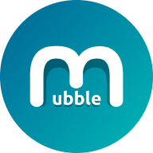
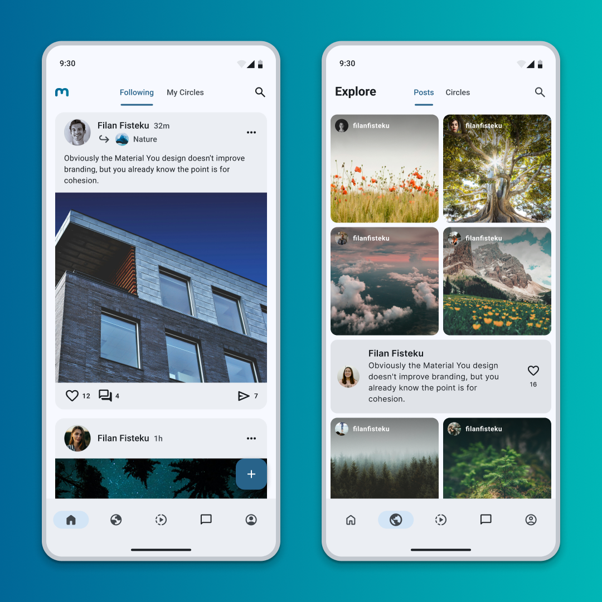
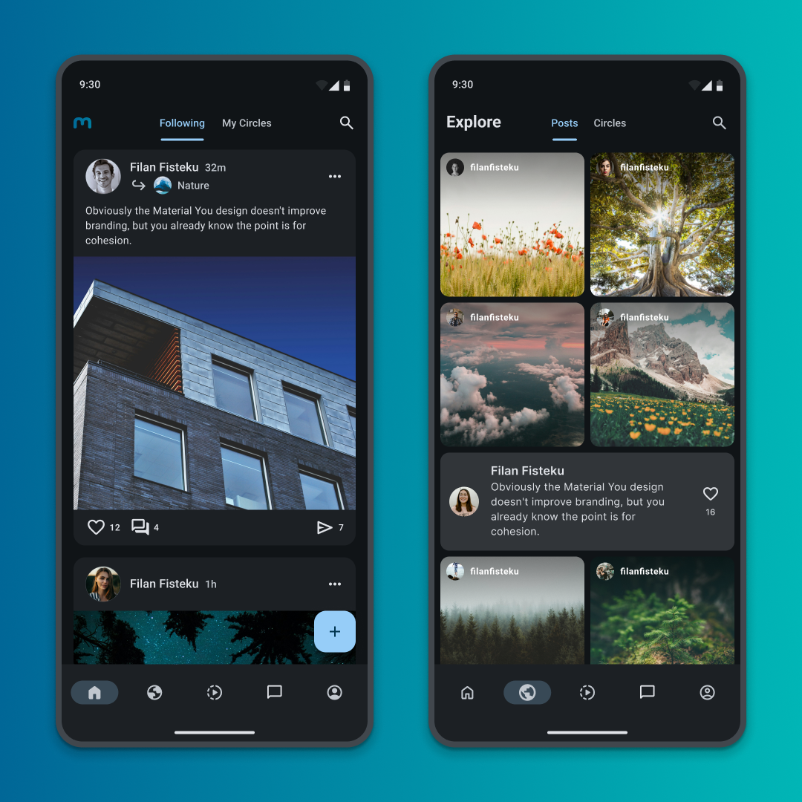
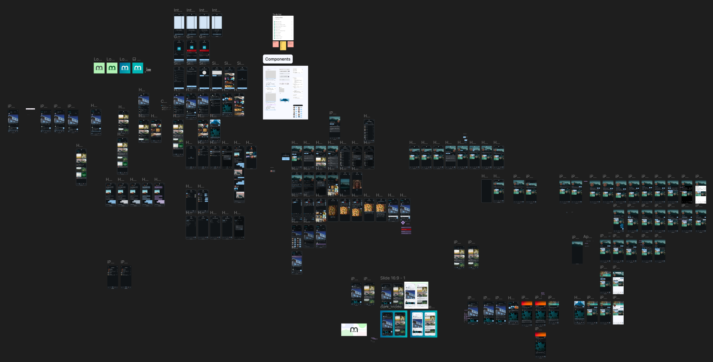

# Mubble App

**Mubble** is a work‑in‑progress social media app built with Kotlin & Jetpack Compose, following Android’s official [architecture guidance](https://developer.android.com/topic/architecture).

This project started as my learning project and bachelor thesis, and is now growing into a full-featured social media app built with modern Material 3 design and architecture.

# Features
### Home & Explore
<p>
  
  
</p>
<p align="center"><em>Home & Explore tabs in light and dark themes</em></p>  

#### Main app features include:

- **Home feed** to see posts from people you follow and groups (circles) you’re part of, with the ability to join and create groups.
- **Posting** images, videos, or text-only posts (bubbles).
- **Explore page** to discover trending content and posts matching your interests.
- **Chat screen** to message friends, send photos, and share posts.
- **Activity tab** showing updates like new follows, likes, and notifications.
- **Profile page** displaying your profile.
- **Videos page** containing short form content.

There is no server communication and most features aren’t implemented yet — besides most of the **UI**, they mainly showcase the app’s design and potential.

# UI & Design

**Mubble** started as a Figma wireframe, went through a lot of iterations, and was then built in Jetpack Compose.

The app was designed following Material Design 3 guidelines, and uses the Material Theme Builder for theme generation. Both the design and the code continue to be updated and refined regularly.

### [Mubble Design Journey on Figma →](https://www.figma.com/community/file/1515513100154545700)
> **Work in progress**: this Figma file shows early designs and their evolution.  
> *Frames are unpolished — final screens yet to be finished.*



### Theme Support
- **Light**, **Dark**, and **Pitch Black***.
- **Dynamic color*** (see [Material 3 dynamic color docs](https://m3.material.io/styles/color/dynamic/choosing-a-source)).
- **Material 3 Expressive** components, shapes & animations.

\* *Planned but not yet implemented — see [Roadmap](#roadmap).*

# Roadmap

### Current Status
- Home screen (mostly done; circle item UI may be updated).
- Explore screen (posts / bubbles screen).
- Chat list and chat content screens.
- Profile screen.
- Settings screen.
- Login / Sign up screens.
- Onboarding screen.

### Planned Features
- Different profile screen for current user (partially implemented) and other users.
- Circle screen (similar to profile UI).
- Activity screen (currently empty).
- New post screen.
- Sendable items in chat: images, videos, posts, bubbles, profiles, circles.
- Camera integration for direct posting or sending to friends.
- Dynamic color support.
- Pitch black theme.
- Chat bubble custom themes (color changes).
- Shared animated transitions for clickable containers (e.g., posts).
- Image picker inside chat.
- Short-form content support (like popular social media platforms).

### Connecting to Server (Upcoming)
- Firebase integration.
- Real-time chat implementation.
- Fetching posts, bubbles, profiles, and other content online.
- Content caching.

### Long-term Ideas
- Custom feed algorithm.
- Voice messages and phone calls in chat.

### Known Issues / TODOs
- Performance optimization might be needed for some state-driven UI changes in Home, Explore, and Profile screens’ custom scaffold.
- Testing on physical devices is still pending.

## Run Locally

1. Clone the project.

```bash
  git clone https://github.com/aidsyla/mubble.git
```
2. Open the project in Android Studio.
3. Let Gradle sync finish.
4. Run the app on an emulator or physical device (API level 24+).

## Contributing

Suggestions and changes are welcome.  
For major updates, please open an issue first to discuss what you would like to change, or contact me directly.

## License

**Mubble** is licensed under the [Apache License 2.0](https://www.apache.org/licenses/LICENSE-2.0).

This project includes and adapts code from the [Now in Android](https://github.com/android/nowinandroid) project, which is also licensed under Apache License 2.0.

Stock images used in this app are from [Unsplash](https://unsplash.com/). While attribution is not required under the [Unsplash License](https://unsplash.com/license), it is appreciated.
